<div align="center">

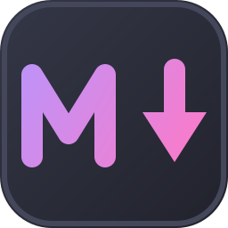

# Emdee

**A fast, themeable Markdown editor for Linux and Windows.**

[](../../actions/workflows/ci.yml)
[](https://www.python.org/)
[](https://www.riverbankcomputing.com/software/pyqt/)
[](LICENSE)
[](#linux)
[](#windows)
[](tests)
[](../../releases/latest)

</div>

---

<div align="center">

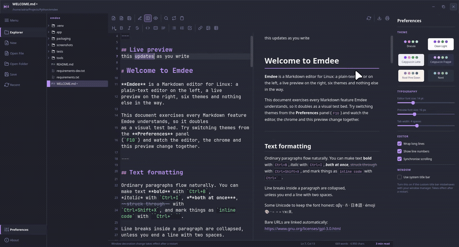

<sub><i>Live theme switching — editor, chrome and preview all repaint together</i></sub>

</div>

#### 📹 Full walkthrough · 47 seconds

https://github.com/user-attachments/assets/d29b37a7-3ff6-4141-87f7-f96039c4375d

<!-- The bare URL above is deliberate. GitHub only renders an inline player for
     a user-attachments URL sitting alone in its own paragraph — wrapping it in
     , [](), a <video> tag or an HTML block turns it back into a plain
     link. The same file is committed at screenshots/demo.mp4, so the repo
     stays self-contained even though the README points at the CDN. -->

<div align="center">

<sub>Also committed in-repo: <a href="screenshots/demo.mp4"><code>screenshots/demo.mp4</code></a></sub>

</div>

---

## What it is

A desktop Markdown editor built around one idea: **plain text on the left, a
real browser engine on the right, and one set of colours driving both.**

Write in a syntax-highlighted plain-text editor, watch a properly styled preview
update as you type, and switch between six themes without restarting anything.
Export what you see to a self-contained HTML file or a PDF.

<div align="center">

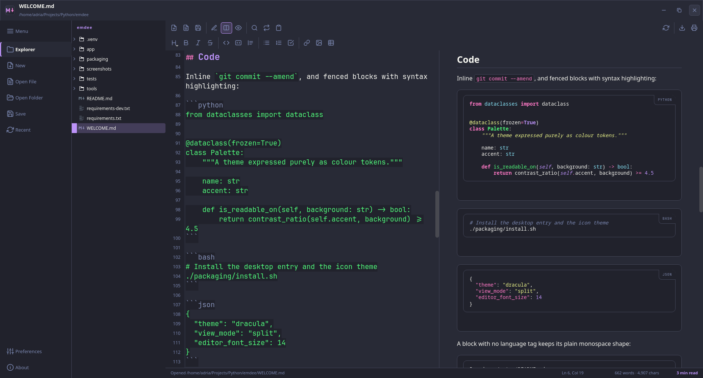

<sub><i>Split view · Dracula · synchronised scrolling anchored to real source lines</i></sub>

</div>

## ✨ Features

**Writing**

- 📝 Plain-text editor with line numbers, Markdown syntax highlighting, smart
  list/blockquote continuation and configurable tab width
- 🔀 Three switchable layouts — editor only, live split, preview only — with a
  250 ms debounce and **two-way scroll sync** anchored to real source lines,
  not a crude percentage
- ⌨️ Full formatting shortcuts that work with *and* without a selection —
  `Ctrl+B`, `Ctrl+K`, `Ctrl+1…6`, and the rest of [the table below](#keyboard-shortcuts)
- 📋 Paste from the clipboard straight into the document; a pasted **image** is
  written to `assets/` next to the file and linked automatically

<table>
<tr>
<td width="50%" align="center">
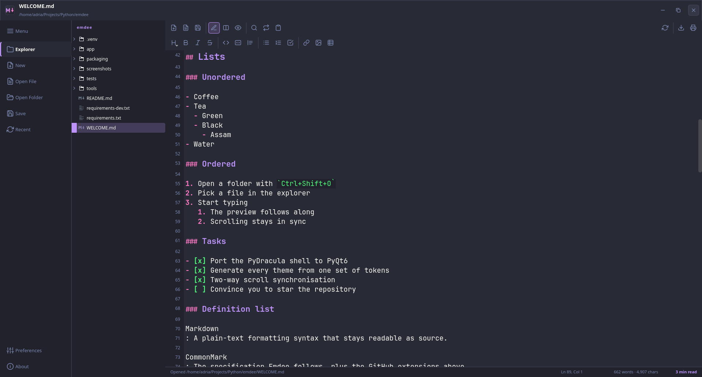
<br><sub><b>Editor only</b> · <code>Ctrl+Shift+1</code> — gutter, list markers, task boxes</sub>
</td>
<td width="50%" align="center">
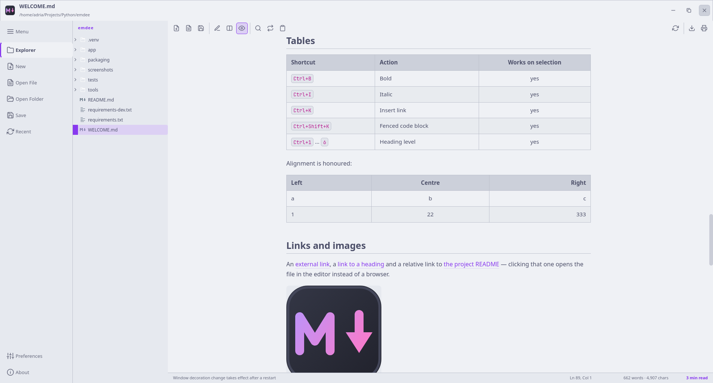
<br><sub><b>Preview only</b> · <code>Ctrl+Shift+3</code> — real CSS tables, Catppuccin Latte</sub>
</td>
</tr>
</table>

**Reading**

- 🎨 CommonMark + GFM — tables, task lists, strikethrough, footnotes,
  definition lists, YAML front matter, heading anchors
- 🌈 Syntax-highlighted code blocks via Pygments, in the active theme's colours
- 🔗 Clicking a link to another Markdown file opens it in the editor; external
  links go to your browser
- 🔒 Raw HTML inside a document is sanitised and the preview runs under a
  restrictive CSP — a downloaded `.md` cannot execute scripts or phone home

**Files**

- 🗂 Folder explorer filtered to Markdown files only, with an unsaved-changes dot
- 💾 **Atomic saves** (temp file + `os.replace`) — an interrupted write can never
  truncate your document
- 👀 External-change detection: edited elsewhere and clean here, it reloads;
  dirty here, it asks
- 🕘 Recent files, drag & drop, UTF-8 everywhere with explicit error handling —
  never a traceback in your face

**Output**

- 📤 Export to a **single self-contained HTML file** — CSS inlined, local images
  embedded as data URIs, favicon included, zero external requests
- 🖨 Export to PDF through Chromium's own print pipeline, with a paper palette
  derived from your theme and sensible page breaks

**Themes**

- 🎛 Six palettes, hot-swappable, all generated from **one** set of colour tokens
- ♿ Every text colour is contrast-corrected to WCAG AA (≥ 4.5:1) — and there is
  [a test](tests/test_contrast.py) that fails if a palette ever regresses

---

## 🎨 Theme gallery

Six palettes, switched from the preferences drawer with no restart. Every shot
below is the same document at the same scroll position, so only the colour
changes.

<table>
<tr>
<td width="33%" align="center">
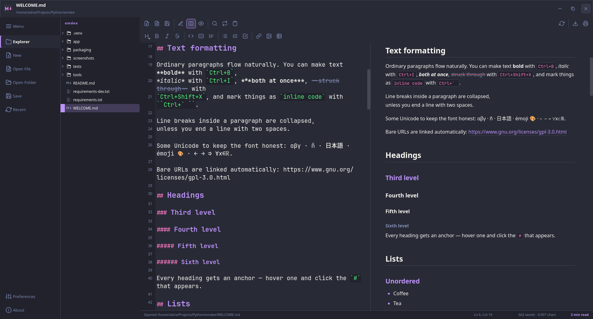
<br><b>Dracula</b> <sub>· dark · default</sub>
</td>
<td width="33%" align="center">
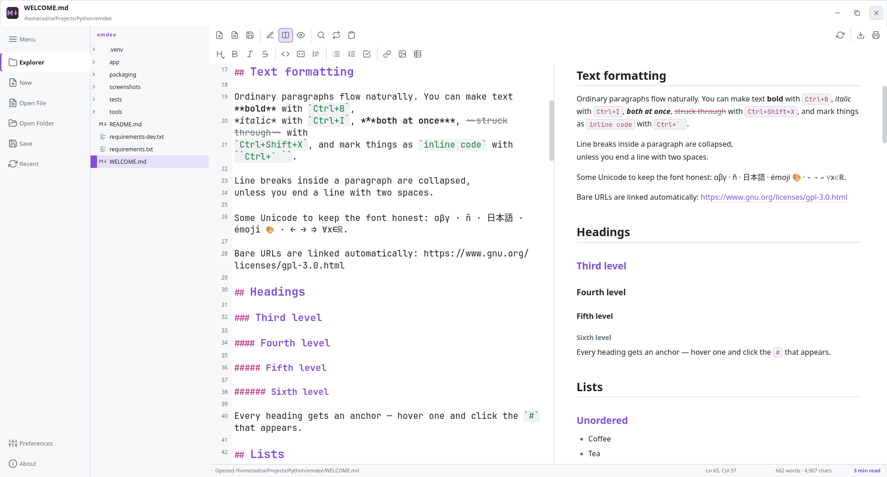
<br><b>Clean Light</b> <sub>· light</sub>
</td>
<td width="33%" align="center">
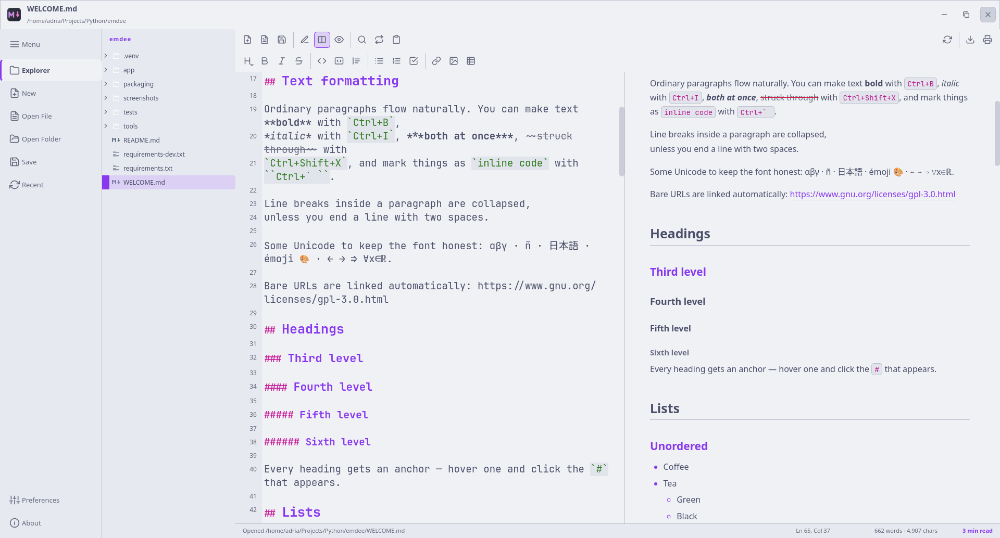
<br><b>Catppuccin Latte</b> <sub>· light</sub>
</td>
</tr>
<tr>
<td width="33%" align="center">
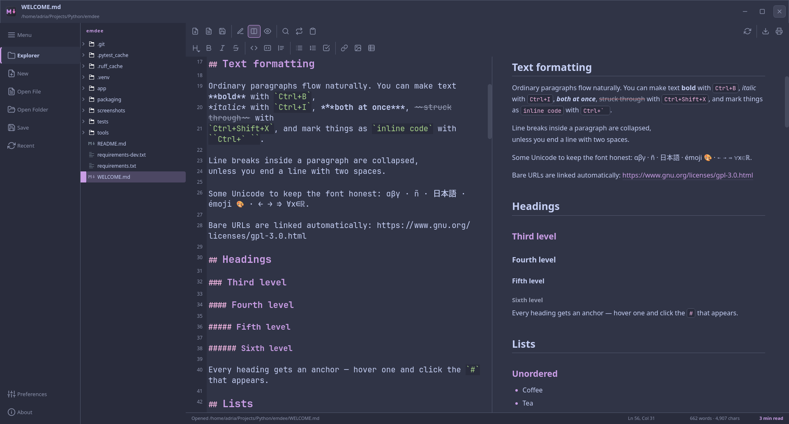
<br><b>Catppuccin Frappé</b> <sub>· dark</sub>
</td>
<td width="33%" align="center">
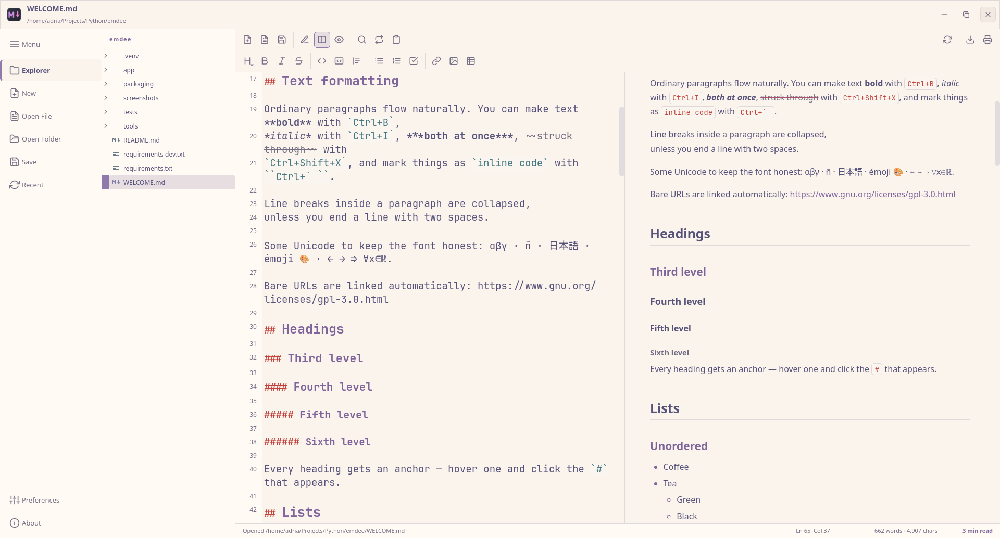
<br><b>Rosé Pine Dawn</b> <sub>· light</sub>
</td>
<td width="33%" align="center">
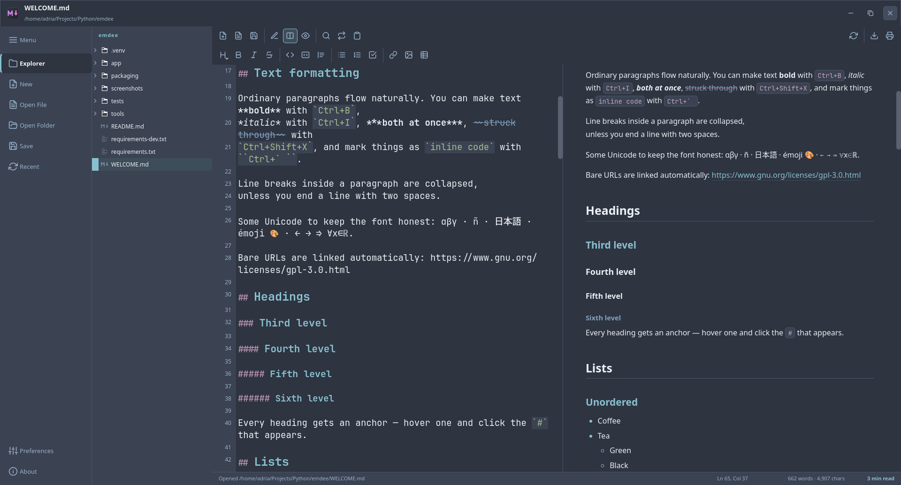
<br><b>Nord</b> <sub>· dark</sub>
</td>
</tr>
</table>

<div align="center">

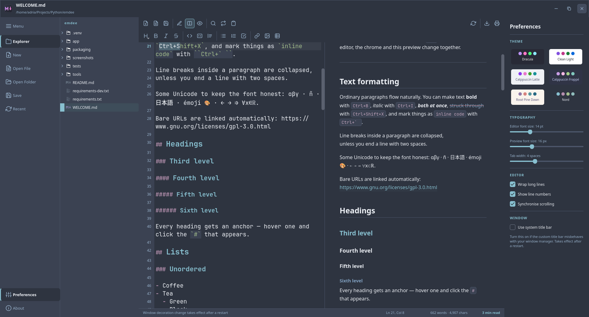

<sub><i>The preferences drawer — <code>F10</code> — with the six swatches. Nord applied.</i></sub>

</div>

<details>
<summary><b>Palette tokens</b></summary>

Swatches are `bg` · `surface` · `text` · `accent` · `accent2` · `green`.

| Theme | Mode | Swatches | Key colours |
| --- | --- | --- | --- |
| **Dracula** | dark |       | `#282a36` · `#bd93f9` · `#ff79c6` |
| **Clean Light** | light |       | `#ffffff` · `#8250df` · `#bf3989` |
| **Catppuccin Latte** | light |       | `#eff1f5` · `#8839ef` · `#ea76cb` |
| **Catppuccin Frappé** | dark |       | `#303446` · `#ca9ee6` · `#f4b8e4` |
| **Rosé Pine Dawn** | light |       | `#faf4ed` · `#907aa9` · `#d7827e` |
| **Nord** | dark |       | `#2e3440` · `#88c0d0` · `#b48ead` |

Some published `muted` values (Dracula's `#6272a4`, for one) do not reach 4.5:1
against their own background. Emdee keeps the literal palette in
[`app/themes/palettes.py`](app/themes/palettes.py) and corrects such colours at
token-derivation time, preserving hue and saturation while moving lightness away
from the surface. So the themes *look* like their originals but stay legible.

</details>

---

## Installation

**Linux** and **Windows 10/11** are both supported. macOS is not: nothing in the
code rules it out, but it has never been built or run there, and claiming
otherwise would be guessing.

### Windows

Grab either artefact from the [**latest release**](../../releases/latest):

| Download | What it is |
| --- | --- |
| `Emdee-<version>-setup.exe` | Installer. Per-user, so no administrator rights and no UAC prompt. Start-menu shortcut, optional `.md` association, clean uninstaller. |
| `Emdee-<version>-windows-x64.zip` | Portable. Unzip anywhere — a USB stick, a folder with spaces in its name — and run `Emdee.exe`. |

Nothing else to install: Python, Qt and the browser engine are all inside.

Both downloads are **unsigned**, so SmartScreen will interrupt the first launch
with "Windows protected your PC" — *More info* → *Run anyway*. A code-signing
certificate costs a few hundred euros a year, which is not something a project
like this carries. Each release ships `SHA256SUMS.txt` if you would rather
verify the bytes than trust the publisher.

<details>
<summary><b>Why the download is ~200 MB</b></summary>

The preview is a real browser engine, not an approximation of one. Qt WebEngine
bundles Chromium, and `Qt6WebEngineCore.dll` alone is 191 MB. The build strips
what it safely can — Chromium's debug resource packs, imaging libraries that
only the icon tooling uses — but the engine itself is the size it is, and that
same engine is what makes the preview and the PDF export faithful.

</details>

<details>
<summary><b>State of the Windows port — read this before filing a bug</b></summary>

Emdee was written on Linux and ported to Windows afterwards. The port is
additive: no Linux behaviour was changed to accommodate it, and every
platform-specific decision goes through
[`app/platform_support.py`](app/platform_support.py) rather than being scattered
through the interface as `sys.platform` checks.

**Verified by hand on Windows 11:** window dragging, edge and corner resizing,
double-click to maximise, `Win`+arrow snapping, Aero Snap, Snap Layouts,
rounded corners and drop shadow; the preview rendering; HTML and PDF export; all
six themes; the portable build running from an arbitrary path; the installer
installing and uninstalling without residue.

**Known limits:**

- **File association needs one confirmation.** The installer registers Emdee as
  a handler for `.md`, but since Windows 10 only the user can appoint a default
  application — the setting is protected by a per-extension hash specifically so
  installers cannot help themselves to it. The first time: right-click a `.md` →
  *Open with* → *Choose another app* → **Emdee** → *Always*.
- **Unsigned binaries.** See above.
- **No automatic updates.** New versions are downloaded from Releases.
- Tested on Windows 11 24H2 at 100% display scaling. The layout is derived from
  font metrics rather than fixed pixels, so other scalings should be fine, but
  "should be" is not "was".

</details>

### Linux

Requires **Python 3.11+**.

#### Arch Linux

```bash
sudo pacman -S python-pyqt6 python-pyqt6-webengine python-markdown-it-py python-pygments
git clone https://github.com/AdriaBC06/emdee.git
cd emdee
python -m app.main
```

`mdit-py-plugins` and `linkify-it-py` may not be packaged; grab them from the
AUR or install them with `pip install --user mdit-py-plugins linkify-it-py`.

#### Debian / Ubuntu

```bash
sudo apt install python3-pyqt6 python3-pyqt6.qtwebengine python3-markdown-it python3-pygments
git clone https://github.com/AdriaBC06/emdee.git
cd emdee
python3 -m app.main
```

#### Fedora

```bash
sudo dnf install python3-pyqt6 python3-pyqt6-webengine python3-markdown-it-py python3-pygments
git clone https://github.com/AdriaBC06/emdee.git
cd emdee
python3 -m app.main
```

#### Virtualenv (any distribution — recommended)

Self-contained and immune to whatever your distribution ships:

```bash
git clone https://github.com/AdriaBC06/emdee.git
cd emdee
python3 -m venv .venv
.venv/bin/pip install -r requirements.txt
.venv/bin/python -m app.main
```

#### Desktop integration

```bash
./packaging/install.sh
```

That installs, entirely inside your home directory and without `sudo`:

- a launcher at `~/.local/bin/emdee` that points at the interpreter you used
  (it prefers `.venv/bin/python` if the project has one)
- `~/.local/share/applications/emdee.desktop`, so Emdee shows up in your
  application menu and can be set as the handler for `text/markdown`
- the icon theme under `~/.local/share/icons/hicolor/`, in every size from
  16 px to 512 px plus the scalable SVG

Then refreshes the desktop and icon caches. Reverse it with
`./packaging/uninstall.sh` — your documents and preferences are left alone.

#### Wayland notes

Emdee is developed on Arch + Wayland and also runs under X11. Window dragging
and resizing use `startSystemMove` / `startSystemResize`, which is the only
approach a Wayland client is allowed to use, so the frameless window behaves
natively on both.

If your compositor and the custom title bar disagree, turn on **Use system title
bar** in Preferences (`F10`) and restart — Emdee will use your window manager's
decorations instead.

On some NVIDIA + Wayland setups Chromium logs `GBM is not supported` and falls
back to Vulkan or software rendering. It is noise, not an error. If the preview
stays blank, force software rendering:

```bash
QTWEBENGINE_CHROMIUM_FLAGS="--disable-gpu" emdee
```

### Running from source on Windows

Same as any Python project — the packaged builds above exist so that users do
not have to do this, but development works the same way on both platforms:

```powershell
git clone https://github.com/AdriaBC06/emdee.git
cd emdee
python -m venv .venv
.venv\Scripts\pip install -r requirements.txt
.venv\Scripts\python -m app.main
```

If the preview pane comes up blank — usually a virtual machine or a remote
desktop session, where there is no usable GPU driver — force software rendering:

```powershell
$env:QTWEBENGINE_CHROMIUM_FLAGS = "--disable-gpu"
.venv\Scripts\python -m app.main
```

---

## Usage

```bash
emdee                      # empty document
emdee notes.md             # open a file
emdee ~/wiki/              # open a folder in the explorer
emdee --verbose            # debug logging
emdee --size 1440x900      # exact window size (reproducible screenshots)
```

On first launch Emdee opens `WELCOME.md`, a document that exercises every
supported Markdown feature.

### Keyboard shortcuts

<table>
<tr><td valign="top">

**File**

| Key | Action |
| --- | --- |
| `Ctrl+N` | New document |
| `Ctrl+O` | Open file |
| `Ctrl+Shift+O` | Open folder |
| `Ctrl+S` | Save |
| `Ctrl+Shift+S` | Save as |
| `F5` | Reload from disk |
| `Ctrl+Shift+E` | Export HTML |
| `Ctrl+P` | Export PDF |
| `Ctrl+Q` | Quit |

**View**

| Key | Action |
| --- | --- |
| `Ctrl+Shift+1` | Editor only |
| `Ctrl+Shift+2` | Split view |
| `Ctrl+Shift+3` | Preview only |
| `F9` | Toggle explorer |
| `F10` | Toggle preferences |
| `Ctrl+=` / `Ctrl+-` | Editor font size |
| `F1` | About |

</td><td valign="top">

**Formatting**

| Key | Action |
| --- | --- |
| `Ctrl+B` | Bold |
| `Ctrl+I` | Italic |
| `Ctrl+Shift+X` | Strikethrough |
| `` Ctrl+` `` | Inline code |
| `Ctrl+Shift+K` | Code block |
| `Ctrl+K` | Link |
| `Ctrl+Shift+I` | Insert image |
| `Ctrl+1` … `Ctrl+6` | Heading level |
| `Ctrl+0` | Back to paragraph |
| `Ctrl+Shift+L` | Bullet list |
| `Ctrl+Shift+N` | Numbered list |
| `Ctrl+Shift+T` | Task list |
| `Ctrl+Shift+Q` | Blockquote |
| `Ctrl+Shift+B` | Insert table |
| `Ctrl+Shift+V` | Paste from clipboard |

**Search & editing**

| Key | Action |
| --- | --- |
| `Ctrl+F` | Find |
| `Ctrl+H` | Find and replace |
| `Enter` / `Shift+Enter` | Next / previous match |
| `Esc` | Close the find panel |
| `Tab` / `Shift+Tab` | Indent / outdent |
| `Enter` | Continue the list or quote |

</td></tr>
</table>

Every formatting shortcut works both ways: with a selection it wraps (and
unwraps) it, without one it inserts the markers and parks the cursor between
them.

<div align="center">

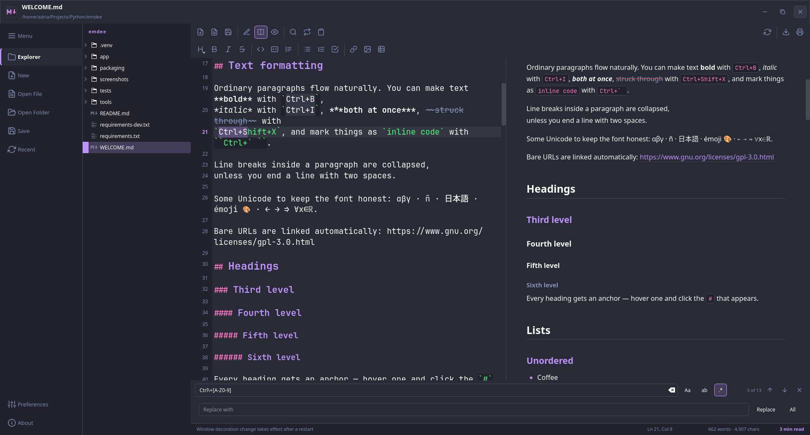

<sub><i>Find &amp; replace is a panel, not a modal — the document stays readable while you refine the query</i></sub>

</div>

---

## 🔐 A real XSS, and the two layers that closed it

Worth telling because it was not theoretical — it was found, reproduced, and
fixed during development.

CommonMark deliberately allows raw HTML to pass through, and Emdee renders that
HTML in Chromium. So a `.md` file — cloned, downloaded, emailed — is untrusted
input. A test document was written to check exactly that:

```markdown
# An innocent-looking document

<script>fetch('file:///etc/passwd').then(r => r.text()).then(exfiltrate)</script>

<a href="javascript:alert(1)">click</a>
<iframe src="https://evil.example"></iframe>
```

Driving the real widget and querying the live DOM gave:

```
onerror ejecutado:   True     ← arbitrary JS running in the preview
iframe presente:     True     ← remote resource loaded from a local document
href javascript:     present
```

With `LocalContentCanAccessFileUrls` enabled — which the preview needs so that
relative images resolve — that JS could read local files. And the `<script>`
tag only failed to run by accident: `innerHTML` does not execute scripts. In the
**HTML export** the same tag is parsed normally, so the payload would have run
on the machine of whoever the document was shared with.

### Layer 1 — sanitise, with a parser that agrees with the browser

Every render passes through [`core/sanitize.py`](app/core/sanitize.py), an
allow-list policy on top of [nh3](https://nh3.readthedocs.io) — the Python
binding for Mozilla's *ammonia*, which parses with **html5ever**, the same
engine Servo and Firefox use.

That last detail is the whole point. The first version of this sanitiser was
hand-written on Python's `html.parser`, and hand-written sanitisers are a
well-known bypass farm: the gap between what your parser thinks a tag is and
what a browser thinks a tag is *is* the vulnerability. Emdee now supplies only
the policy — tags, attributes, URL schemes, `data:` limited to raster images,
`style` limited to table alignment — and never touches the parsing.

Swapping the implementation was safe precisely because the security tests came
first: all of them kept passing, unchanged, against the new engine.

### Layer 2 — a CSP with a per-load nonce

The preview shell is served with `default-src 'none'` and a fresh nonce on every
load, so only Emdee's own scroll-sync script may execute:

```
script-src 'nonce-<random>' qrc:;  connect-src 'none';
frame-src 'none';  object-src 'none';  base-uri 'none';  form-action 'none'
```

The two layers are genuinely independent, and that was verified rather than
assumed — with the sanitiser **deliberately bypassed** and hostile HTML injected
straight into the page, nothing runs:

```
script inline ejecutado: False
onerror ejecutado:       False
```

The exported HTML carries its own strict CSP too, and because sanitising happens
in the renderer rather than in the widget, **what you publish is sanitised by the
same pass as what you preview**.

Alongside that, the preview's `QWebEngineSettings` explicitly disable local
storage, plugins, WebGL, clipboard access, screen capture and remote loads from
local content, and every main-frame navigation Emdee did not initiate is
refused. One related finding was fixed at the same time: the HTML export used to
inline *any* relative image path, so `` would have
been quietly base64-embedded into a file you then shared. Image inlining is now
contained to the document's own folder, symlinks resolved first.

The security tests live in
[`tests/test_sanitize.py`](tests/test_sanitize.py) — 34 of the 179.

---

## Project structure

```
emdee/
├── app/
│   ├── main.py                  # entry point, GPL header, CLI
│   ├── paths.py                 # resource_path() — PyInstaller-aware, no .qrc
│   ├── core/                    # ── zero PyQt6.QtWidgets imports ──
│   │   ├── document.py          #    text buffer + dirty-state tracking
│   │   ├── renderer.py          #    markdown-it-py → HTML + Pygments
│   │   ├── textops.py           #    every text transformation, pure functions
│   │   ├── file_service.py      #    atomic I/O, UTF-8, human-readable errors
│   │   ├── page.py              #    self-contained HTML document assembly
│   │   ├── sanitize.py          #    nh3/ammonia policy for untrusted HTML
│   │   └── settings.py          #    typed QSettings wrapper (QtCore only)
│   ├── themes/
│   │   ├── palettes.py          #    the six palettes — the only place colours live
│   │   ├── contrast.py          #    WCAG maths + the readability corrector
│   │   ├── qss_template.py      #    application stylesheet template
│   │   ├── preview_css.py       #    preview / export / print stylesheet template
│   │   ├── pygments_style.py    #    code theme, generated from the same tokens
│   │   └── manager.py           #    hot-swap: one call repaints everything
│   ├── ui/
│   │   ├── main_window.py       #    PyDracula shell, wiring, actions
│   │   ├── title_bar.py         #    frameless chrome (startSystemMove/Resize)
│   │   ├── editor.py            #    QPlainTextEdit + gutter + smart Enter
│   │   ├── highlighter.py       #    QSyntaxHighlighter for Markdown
│   │   ├── preview.py           #    QWebEngineView + QWebChannel scroll sync
│   │   ├── file_tree.py         #    Markdown-filtered explorer
│   │   ├── find_replace.py      #    inline find/replace with regex
│   │   ├── settings_panel.py    #    sliding preferences drawer
│   │   ├── toolbar.py           #    reusable icon strips
│   │   ├── icons.py             #    SVG recolouring per theme
│   │   └── about.py             #    version, licence, credits
│   └── resources/icons/
│       ├── app/                 #    logo.svg, logo-small.svg, logo-mono.svg
│       └── ui/                  #    39 hand-written interface icons
├── packaging/
│   ├── emdee.desktop            # freedesktop Desktop Entry
│   ├── icons/hicolor/           # generated PNG + SVG icon theme
│   ├── install.sh
│   ├── uninstall.sh
│   └── windows/
│       ├── emdee.spec           #    PyInstaller build, verifies its own output
│       ├── emdee.iss            #    Inno Setup installer
│       ├── entry_point.py       #    frozen-build shim (imports app as a package)
│       ├── version_info.txt     #    Windows VERSIONINFO resource
│       ├── emdee.ico            #    generated multi-resolution icon
│       └── build.ps1            #    both artefacts, one command — used by CI too
├── .github/workflows/
│   ├── ci.yml                   # ruff + pytest on Linux, pytest + build on Windows
│   └── release.yml              # tagged builds published to a Release
├── tools/build_icons.py         # SVG → every size and the .ico, in one command
├── pyproject.toml               # pytest + ruff configuration
├── tests/                       # 179 tests, no QApplication required
├── screenshots/                 # images used by this README
├── WELCOME.md                   # feature-complete demo document
├── requirements.txt
├── LICENSE                      # GNU GPL v3
└── NOTICE                       # MIT attribution for PyDracula and the rest
```

---

## Tech stack

| Layer | Choice |
| --- | --- |
| Language | Python 3.11+ |
| Platforms | Linux (Wayland · X11) · Windows 10/11 |
| GUI toolkit | PyQt6 |
| Preview | PyQt6-WebEngine (`QWebEngineView` + `QWebChannel`) |
| Markdown | markdown-it-py + mdit-py-plugins + linkify-it-py |
| Sanitising | nh3 (Mozilla ammonia / html5ever) |
| Highlighting | Pygments (editor: a custom `QSyntaxHighlighter`) |
| Shell design | PyDracula patterns, reimplemented for PyQt6 |
| Windows packaging | PyInstaller · Inno Setup 6 |
| Tests / lint | pytest · ruff · GitHub Actions on both platforms |

### Architecture decisions

<details>
<summary><b>Why <code>QWebEngineView</code> instead of <code>QTextBrowser</code>?</b></summary>

Qt's rich-text engine understands a subset of HTML 4. No flexbox, no grid, no
`position: sticky`, no `border-radius` worth the name, and its table layout is
famously rough. Every good-looking Markdown preview needs real CSS.

The practical clincher is export: `QWebEnginePage.printToPdf()` gives a faithful
PDF from the exact same document the preview shows, honouring `break-inside`
and `@page`. Reimplementing that on top of `QTextDocument` would be a project
of its own.

The cost is a ~150 MB Chromium dependency and a slower cold start. For a desktop
editor whose entire job is showing formatted documents, that is the right trade.

</details>

<details>
<summary><b>Why generate every stylesheet from one token set?</b></summary>

A theme has to reach four places at once: the Qt stylesheet, the preview CSS,
the editor's syntax highlighter and the Pygments code style. Maintaining those
by hand means six themes × four stylesheets = 24 files to keep in sync, and they
*will* drift.

Instead, [`palettes.py`](app/themes/palettes.py) holds twelve colours per theme
and everything else is derived: hover tints, selection backgrounds, code
backgrounds, and — importantly — contrast-corrected foregrounds for each
surface. Adding a seventh theme means adding twelve hex codes. Nothing else.

It also makes accessibility testable rather than aspirational: because the
corrections happen in one function, [one test](tests/test_contrast.py) can walk
every text/surface pair in every theme and assert 4.5:1.

</details>

<details>
<summary><b>Why was the <code>.qrc</code> resource system removed?</b></summary>

PyDracula is a PySide6 template and compiles its assets with `pyside6-rcc` into
a `resources_rc.py`. **PyQt6 has no `pyrcc6`** — Riverbank dropped the resource
compiler in the Qt6 port. Porting the template's `.qrc` was therefore not a
matter of renaming a command; the mechanism does not exist.

Rather than vendor a generated file from the other binding, Emdee loads every
asset from disk through [`resource_path()`](app/paths.py), which also understands
PyInstaller's `sys._MEIPASS`. The bonus: icons are plain SVG files whose
`currentColor` is substituted at load time, which is what lets one icon set
serve six themes.

</details>

<details>
<summary><b>How is an untrusted Markdown file kept from running code?</b></summary>

Two independent layers: an allow-list sanitiser built on nh3 / Mozilla ammonia,
and a per-load CSP nonce on the preview page. The full story — including the
reproduction that found the hole — is in
[**A real XSS, and the two layers that closed it**](#-a-real-xss-and-the-two-layers-that-closed-it).

</details>

<details>
<summary><b>Why GPL-3.0-or-later?</b></summary>

Not a preference — an obligation. PyQt6 is distributed under the GPL v3 (or a
commercial licence from Riverbank). Any open-source application linking against
it must be GPL-compatible, so Emdee is GPL-3.0-or-later and ships the full
licence text.

PyDracula is MIT, which *is* GPL-compatible: its interface patterns can be
incorporated as long as the copyright notice travels along. It does, in
[NOTICE](NOTICE).

</details>

<details>
<summary><b>Why does the frameless window work in two completely different ways?</b></summary>

Because "frameless with a custom title bar" is not one problem. It is two, and
they have opposite solutions.

**On Linux**, the usual recipe — track mouse deltas, call `move()` — does
nothing under Wayland, where a client is not allowed to position its own
surface. `QWindow.startSystemMove()` / `startSystemResize()` hand the
interaction to the compositor instead, which works on Wayland *and* gives
correct edge snapping on X11.

**On Windows** that same call is the wrong tool: it starts a drag the window
manager did not ask for, and setting `FramelessWindowHint` throws away Aero
Snap, Snap Layouts, the resize borders, the drop shadow and the rounded
corners — everything that makes a window feel like it belongs on the desktop.
The native approach is the inverse: keep an ordinary top-level window, and
suppress only the *drawing* of its non-client area by handling `WM_NCCALCSIZE`,
then answer `WM_NCHITTEST` yourself so Windows still believes it owns the
caption and the borders. It does, so all of its own behaviours keep working,
including `Win`+arrow and the Snap Layouts flyout.

Which path is taken is decided once, by
[`uses_native_frame_hit_testing()`](app/platform_support.py), rather than by
`sys.platform` checks scattered through the interface. And on both platforms,
**Use system title bar** in Preferences falls back to the window manager's own
decorations if the custom chrome misbehaves.

</details>

---

## Development

```bash
python -m venv .venv
.venv/bin/pip install -r requirements-dev.txt

.venv/bin/python -m pytest              # 179 tests
.venv/bin/ruff check              # lint (configured in pyproject.toml)
.venv/bin/python tools/build_icons.py --check   # regenerate icons + contact sheet
```

`core/` never imports `PyQt6.QtWidgets`, so the interesting logic — rendering,
text transformations, atomic I/O, dirty-state tracking, contrast maths — is
tested without ever constructing a `QApplication`.

The suite runs on both platforms and skips by *capability* rather than by
platform name — POSIX permission bits and Windows file locking are genuinely
different phenomena, so each is tested where it exists instead of both being
reduced to whatever they have in common. A skip always says which platform
feature was missing; see [`tests/conftest.py`](tests/conftest.py).

### Building the Windows artefacts

```powershell
.venv\Scripts\pip install pyinstaller
winget install JRSoftware.InnoSetup

powershell -ExecutionPolicy Bypass -File packaging\windows\build.ps1
```

That writes `dist\Emdee\` (the unpacked application), the portable `.zip` and
the installer. It is the same script CI runs, so a release is built by the
recipe that was tested rather than by a second one that drifts from it.

Packaging Qt WebEngine has one signature failure: the application starts, the
window opens, and the preview pane is silently blank because
`QtWebEngineProcess.exe` or Chromium's resource packs did not make it into the
bundle. Both [`emdee.spec`](packaging/windows/emdee.spec) and the workflows
check for those files explicitly and fail the build if they are missing — the
one bug a "does it launch?" smoke test will happily wave through.

`tools/build_icons.py --check` also writes a magnified contact sheet at
`packaging/icons/contact-sheet.png`. The icon has to stay readable at 16 px;
because two glyphs cannot survive that size, the 16 and 24 px buckets are
rasterised from a deliberately simplified source (`logo-small.svg`) — the same
trick hand-tuned icon themes use.

---

## Roadmap

Done since the first release:

- [x] **Windows 10/11 port** — native window chrome, `%APPDATA%` paths, atomic
      saves that account for Windows file locking
- [x] **Windows packaging** — portable build and an Inno Setup installer
- [x] **CI** — ruff and pytest on Linux, pytest and a packaged build on Windows,
      tagged releases published automatically

Ideas, not commitments:

- [ ] Document outline / table-of-contents panel
- [ ] Multiple open documents in tabs
- [ ] Mermaid and KaTeX rendering in the preview
- [ ] Custom user themes loaded from a config file
- [ ] Spell checking
- [ ] Linux binary packaging — AppImage, Flatpak, AUR
- [ ] Code signing for the Windows builds, so SmartScreen stops warning
- [ ] A macOS port, if someone wants to maintain it

## Contributing

Issues and pull requests are welcome.

Before opening a PR: `pytest` should pass, `ruff check` should be clean, and new colours should go through the token system rather than being
written into a stylesheet. Public functions carry type hints; `core/` stays free
of widget imports.

By contributing you agree that your work is licensed under GPL-3.0-or-later.

## License

<div align="center">

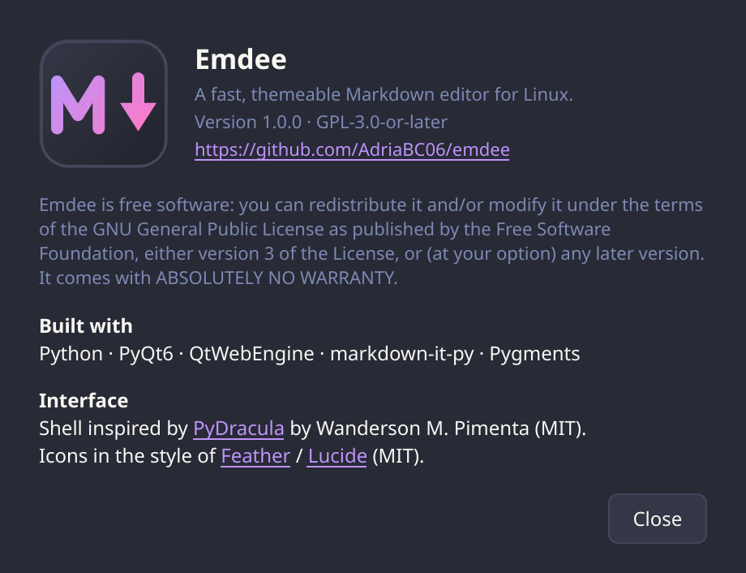

</div>

Emdee is free software licensed under the
**[GNU General Public License, version 3 or later](LICENSE)**.

It comes with ABSOLUTELY NO WARRANTY. You are free to redistribute it under the
terms of the GPL.

## Credits

- **[PyDracula](https://github.com/Wanderson-Magalhaes/Modern_GUI_PyDracula_PySide6_or_PyQt6)**
  by **Wanderson M. Pimenta** (MIT) — the interface language this shell is built
  on: the collapsible icon rail, the custom title bar, the sliding settings
  drawer. Reimplemented for PyQt6; see [NOTICE](NOTICE).
- **[Dracula](https://draculatheme.com)**, **[Catppuccin](https://catppuccin.com)**,
  **[Rosé Pine](https://rosepinetheme.com)** and **[Nord](https://www.nordtheme.com)**
  for the palettes (all MIT).
- **[Feather](https://feathericons.com)** / **[Lucide](https://lucide.dev)** for
  the interface icon language (MIT / ISC).
- **[markdown-it-py](https://github.com/executablebooks/markdown-it-py)** and
  **[Pygments](https://pygments.org)** for doing the actual hard parts.

The Emdee logo was designed for this project and is released under the same
licence as the code.
